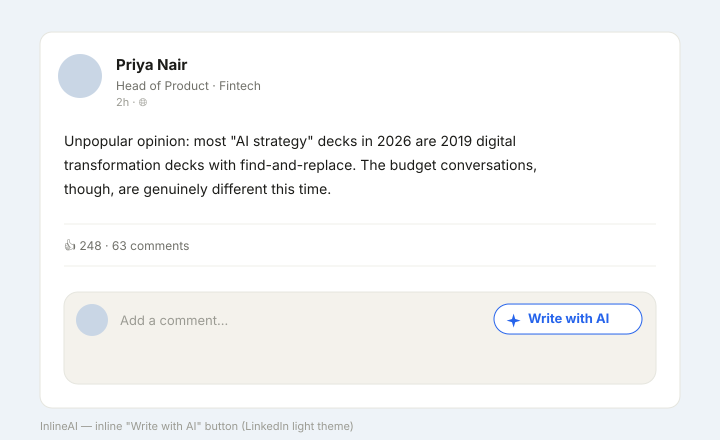
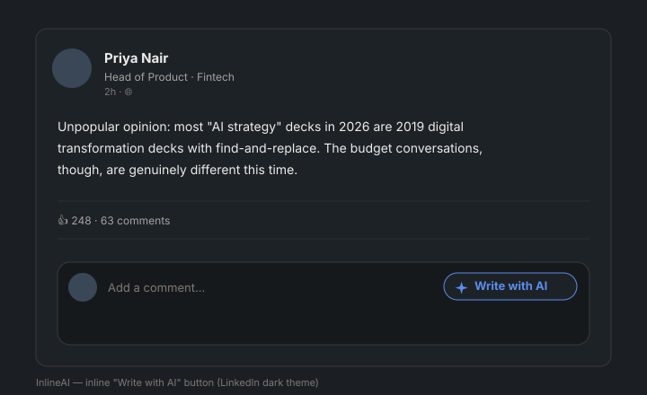

# InlineAI for LinkedIn & X

[](https://github.com/NishkarshG/Linkedin-extension-comments/actions/workflows/ci.yml)
[](LICENSE)


Open-source, bring-your-own-key Chrome extension that drafts genuinely personalised LinkedIn comments and X (Twitter) replies, right inside the comment box.

When you click into a LinkedIn comment box or an X reply box, a small **✦ Write with AI** pill appears next to it. Click it and InlineAI reads the post, sends it to *your* chosen AI model with a carefully engineered skill prompt for that site, and writes a specific, human-sounding comment straight into the box. You review it, edit it, and post it yourself. **It never posts for you.**




## Contents

- [Why this exists](#why-this-exists)
- [Features](#features)
- [Install](#install)
- [Get an API key](#get-an-api-key)
- [Using it](#using-it)
- [Make it sound like you](#make-it-sound-like-you)
- [Supported AI providers](#supported-ai-providers)
- [Privacy and permissions](#privacy-and-permissions)
- [Customising the skill prompts](#customising-the-skill-prompts)
- [Settings reference](#settings-reference)
- [Troubleshooting](#troubleshooting)
- [FAQ](#faq)
- [How it works](#how-it-works)
- [Develop](#develop)
- [Contributing](#contributing)
- [Roadmap](#roadmap)
- [License](#license)

## Why this exists

Most AI comment tools produce generic, obviously-AI comments ("Great post!", "Couldn't agree more!") that quietly damage your reputation. InlineAI is different on four axes:

- **Truly open source** (MIT). Read every line, including the prompts.
- **Bring your own key.** You pay your AI provider directly. No subscription, no proxy, no markup. Several providers have free tiers.
- **Privacy first.** No backend, no account, no tracking. Your API key stays in your browser and only ever goes to the provider you pick.
- **Comment quality.** The product *is* the skill prompts, one per site: the [LinkedIn skill](src/skills/linkedin-skill.md) and the [X skill](src/skills/x-skill.md). Specific over generic, human over corporate, one sharp idea per comment.

## Features

- **LinkedIn comments and replies** on the feed, single posts, profiles, company, school, group, event and search pages. Reads the author, headline, post text (clicking "see more" first), hashtags and media type. When you reply to a comment, it reads both the post and that comment, and keeps the **@mention** LinkedIn adds.
- **X replies** in the reply box under a post and in the reply dialog, on `x.com` and `twitter.com`. Reads the author's name and @handle, the post text including emoji, media, and any quoted post. Replies stay under 280 characters.
- **Your voice**, from an optional persona and a few of your own comments as voice samples.
- **Six AI providers**, including free tiers and fully local models (Ollama).
- **Streaming** on LinkedIn: the comment types itself into the box as it is generated.
- **Safe by default:** never posts, never overwrites your own draft without asking, never runs in messages or DMs, and returns "Not worth a comment" for spam or engagement bait.
- **Keyboard first:** `Alt+Shift+W` writes, `Esc` cancels.
- **Light and dark themes** that follow the site.

## Install

InlineAI is not on the Chrome Web Store yet, so you load it yourself. It takes about two minutes.

**You need:** Google Chrome (or another Chromium browser such as Edge, Brave or Arc), [Node.js](https://nodejs.org) 18 or newer, and [pnpm](https://pnpm.io) (run `corepack enable` once to get the version this project pins).

1. Get the code and build it:
   ```bash
   git clone https://github.com/NishkarshG/Linkedin-extension-comments.git
   cd Linkedin-extension-comments
   pnpm install
   pnpm build
   ```
   This creates a `dist/` folder, which is the extension.
2. Open `chrome://extensions` and turn on **Developer mode** (top right).
3. Click **Load unpacked** and select the `dist/` folder.
4. The InlineAI settings tab opens automatically. Pick an AI provider, click **Allow access** (Chrome asks you to let the extension reach that one provider), paste your API key, and click **Test connection**.
5. Optionally fill in your persona and voice samples (see [Make it sound like you](#make-it-sound-like-you)).
6. Open LinkedIn or X, click into a comment or reply box, and click **✦ Write with AI**.

> **No build tools?** Every CI run builds a ready-to-load zip. Open the repo's [Actions](https://github.com/NishkarshG/Linkedin-extension-comments/actions) tab, pick the latest green run on `main`, download the `inlineai-extension` artifact (needs a GitHub login), unzip it, and load that folder in step 3.

### Updating

```bash
git pull
pnpm install
pnpm build
```

Then click the **↻ reload** icon on the InlineAI card in `chrome://extensions`, and **refresh any open LinkedIn or X tabs**. Tabs that were open before the reload keep running the old version until they are refreshed.

## Get an API key

You need a key from one provider (or none, if you run a local model with Ollama).

| Provider | Where to get a key | Cost |
| --- | --- | --- |
| Groq | [console.groq.com/keys](https://console.groq.com/keys) | Free tier, the easiest way to try InlineAI |
| Google Gemini | [aistudio.google.com/app/apikey](https://aistudio.google.com/app/apikey) | Free tier |
| OpenAI | [platform.openai.com/api-keys](https://platform.openai.com/api-keys) | Pay as you go |
| Anthropic (Claude) | [console.anthropic.com/settings/keys](https://console.anthropic.com/settings/keys) | Pay as you go |
| OpenRouter | [openrouter.ai/keys](https://openrouter.ai/keys) | Pay as you go, some free models |
| Local (Ollama) | [ollama.com/download](https://ollama.com/download) | Free, runs on your computer |

A comment is a small request (a few hundred tokens), so pay-as-you-go costs are typically a fraction of a cent per comment.

## Using it

| Action | How |
| --- | --- |
| Write a comment | Click **✦ Write with AI** next to the box, or press `Alt+Shift+W` (`Option+Shift+W` on Mac) inside it |
| Cancel while it is writing | `Esc`, click the pill again, or start typing in the box |
| Try again | Click the pill again. It replaces its own comment without asking |
| Keep your own text | If the box already holds text you typed, InlineAI asks before replacing it |

**LinkedIn:** works on the feed, single posts, profiles, company, school, group, event and search pages. Never in messaging or the "Start a post" box.

**X:** works in the reply box under a post and in the reply dialog. It stays out of the "What's happening?" new-post box and direct messages. X replies appear in one go instead of streaming, because X's editor (Draft.js) only accepts text reliably as a single paste.

If a post is spam, a scam or engagement bait, the model can decline and the pill shows **"Not worth a comment"**.

## Make it sound like you

Nothing about any one person's voice is built into InlineAI. Open the settings and fill in the **Persona** (all optional):

- **Name, role, expertise, industry:** decide *what* you notice. A designer notices the UI, a founder notices pricing, an engineer notices the architecture.
- **Voice notes:** a line about your style, like "casual, simple English, no corporate words".
- **Voice samples:** paste 3 to 5 comments you wrote yourself, one per line. InlineAI copies *how* you write (length, tone, punctuation, emoji, language mix), never *what* you said. Samples are trimmed to 1,500 characters.

Leave it all empty and you get a plain, friendly default voice. The same persona is used on LinkedIn and X.

## Supported AI providers

| Provider | Default model | Notes |
| --- | --- | --- |
| OpenAI | `gpt-5.4-mini` | Reasoning models (GPT-5 family, o series) handled automatically |
| Anthropic (Claude) | `claude-haiku-4-5` | Called directly from the browser; the system prompt is prompt-cached |
| Google Gemini | `gemini-3.5-flash-lite` | Thinking kept low so it cannot eat the output budget |
| OpenRouter | `openai/gpt-4o-mini` | Type any model id (hundreds available) |
| Groq | `openai/gpt-oss-120b` | Fastest, generous free tier |
| Local (Ollama) | `llama3.1:8b` | No key needed; start Ollama with `OLLAMA_ORIGINS=chrome-extension://*` |

Every provider also accepts a **custom model id**, because providers retire models every few months. If a saved model has been retired (for example `gemini-1.5-flash` or Groq's `llama-3.3-70b-versatile`), InlineAI falls back to the provider default and tells you in settings. Model lists were last reviewed in September 2026.

## Privacy and permissions

### Permissions

InlineAI asks for as little as possible:

- `storage`: to keep your settings on this device.
- The content script runs only on `linkedin.com`, `x.com` and `twitter.com` pages.
- **One AI provider host, on demand.** Provider hosts are optional permissions. Chrome asks you when you pick a provider (or click **Allow access**), so you never grant access to AI services you do not use.

The content script is intentionally **not** web accessible, so pages cannot probe for the extension's files to detect it.

### Where your API key is stored

Your key is written **only** to `chrome.storage.local` on this device. It is:

- never stored in `chrome.storage.sync`, `localStorage`, or cookies;
- never logged (debug logging masks all but the last 4 characters);
- never sent anywhere except the provider you selected.

The Gemini key is sent in the `x-goog-api-key` header, never in the URL.

### What is sent to your AI provider

Only when you click the pill (or press the shortcut), and only to the provider you chose:

- the post author's name and headline (on X: display name and @handle);
- the post text and hashtags, plus the text of a quoted post on X;
- the media type (text, image, video, document, article, repost) and a post type guess;
- when you reply to a comment, that comment's text (up to 600 characters);
- your persona fields and voice samples;
- the system prompt (the skill for that site, or your custom prompt).

Never sent: the full page, your profile, your feed, or your activity history. Post text is escaped and marked as untrusted in the prompt, so a post cannot smuggle instructions to the model. The same list is shown in the settings page under **What is sent to your AI provider**.

## Customising the skill prompts

Each site has its own system prompt, and they are the heart of the product:

- [`src/skills/linkedin-skill.md`](src/skills/linkedin-skill.md) for LinkedIn comments.
- [`src/skills/x-skill.md`](src/skills/x-skill.md) for X replies (short, conversational, never over 280 characters).

In the settings page you can:

- **View each one** verbatim (switch between LinkedIn and X, with a copy button), so you always know what is being sent on your behalf.
- **Override each one separately** under *Advanced → Custom system prompt*. A **Reset to default** button restores the bundled skill at any time.

A custom prompt fully replaces the bundled skill for that site, so start from a copy of the bundled one. If you improve a skill, please open a PR: prompt changes are treated like product launches.

## Settings reference

| Setting | What it does | Default |
| --- | --- | --- |
| Provider, model, API key | Which AI writes the comment | OpenAI, provider default model |
| Persona and voice samples | Your angle and writing style | Empty (friendly default voice) |
| Stream the comment | Types the comment into the box as it is generated (LinkedIn) | On |
| Auto-expand "see more" | Clicks "see more" on long LinkedIn posts before reading them | On |
| Debug logging | Logs selector diagnostics to the page console (never your key) | Off |
| Max output length | Output token cap, 20 to 2,000 | 200 |
| Creativity (temperature) | Higher is more varied; ignored by reasoning models | 1.0 |
| Custom system prompt | Replaces the bundled skill, one per site | Empty |

## Troubleshooting

| Problem | Fix |
| --- | --- |
| The pill does not appear | Refresh the LinkedIn or X tab (always needed after installing or reloading the extension). On X, the pill only shows in reply boxes, not the new-post box. |
| "InlineAI was updated. Refresh this page to use it." | The extension was reloaded while the tab was open. Refresh the tab. |
| "Allow InlineAI to reach … in settings." | Open settings and click **Allow access** next to your provider. |
| "Invalid API key" | Paste the key again in settings, then click **Test connection**. |
| "Rate limited by provider" | Wait a few seconds, or switch to a paid tier or another provider. |
| "Ollama blocked the request" | Restart Ollama with `OLLAMA_ORIGINS=chrome-extension://*` set. |
| "… could not find that model" | Pick another model, or check the custom model id. |
| "The comment was cut off" | Raise **Max output length** in settings. |
| "Couldn't read the post" or "Couldn't type into the box" | The site probably changed its page structure. Turn on **Debug logging**, try again, and open an issue with the `[InlineAI]` lines from the page console. |
| Comments do not sound like you | Add voice samples and voice notes in the persona. Check that no custom system prompt is overriding the skill. |

## FAQ

**Does it post for me?** No. It only writes into the box. You always read, edit and click Post or Reply yourself.

**Is it free?** The extension is free and open source. You pay your AI provider for usage, and Groq, Gemini and local Ollama models let you use it for free.

**Is it on the Chrome Web Store?** Not yet. Load it unpacked as described in [Install](#install).

**Which browsers work?** Chrome 116 or newer, and Chromium-based browsers such as Edge, Brave and Arc. Firefox and Safari are not supported.

**Does it collect any data?** No. There is no server. Settings stay in your browser, and post content goes only to the AI provider you picked, only when you click.

**Is this allowed on LinkedIn and X?** InlineAI does not automate anything: it drafts text that you review and post yourself, one comment at a time. You are still responsible for what you post and for following each site's terms.

## How it works

- **Content script** (vanilla TypeScript and Shadow DOM, no React, no zod) detects the comment box, renders the pill, extracts the post, and inserts the result. Site specifics live behind one small adapter per site ([`platform.ts`](src/content/platform.ts)): [`linkedin-dom.ts`](src/content/linkedin-dom.ts) and [`x-dom.ts`](src/content/x-dom.ts). Selectors are anchored on stable signals (ARIA roles, `data-urn` on LinkedIn, `data-testid` on X) with fallbacks for when class names rotate. X's composer is a Draft.js editor, so text goes in through a paste event, the only path that keeps Draft's own model, the Reply button and the character counter in sync. The script stays under a 30 KB gzipped budget (CI enforces it).
- **Background service worker** makes the cross-origin AI call (it holds the provider host permission, which content scripts do not in Manifest V3) and streams the comment back over a port. Requests time out after 60 seconds; empty or cut-off answers are reported instead of failing silently.
- **Popup and options pages** (React and Tailwind) handle settings, with four hand-built UI primitives (Button, Input, Select, Toggle).
- **AI layer** is native `fetch` with a thin per-provider abstraction. No vendor SDKs, which saves 500 KB+ of bundle weight.

### Project structure

```
src/
  background/service-worker.ts   AI calls, streaming, timeouts
  content/
    index.ts                     pill lifecycle, shortcuts, generation flow
    platform.ts                  picks the LinkedIn or X adapter by hostname
    linkedin-dom.ts              LinkedIn selectors and post extraction
    x-dom.ts                     X selectors and post extraction
    inserter.ts                  writing into LinkedIn's editor and X's Draft.js editor
    button.ts, styles.css        the Shadow DOM pill
  llm/
    providers/                   OpenAI, Anthropic, Gemini, OpenRouter, Groq, Ollama
    prompt.ts                    system prompt choice and user prompt builder
    types.ts                     settings schema, provider list
  options/, popup/               React settings UI
  skills/
    linkedin-skill.md            system prompt for LinkedIn comments
    x-skill.md                   system prompt for X replies
  storage/storage.ts             chrome.storage.local wrapper
  manifest.ts                    Manifest V3 definition
scripts/                         content script build and manifest patch
tests/                           Vitest unit tests
```

## Develop

```bash
pnpm dev         # Vite + CRXJS with hot reload (load dist/ unpacked once)
pnpm typecheck   # tsc --noEmit, strict
pnpm test        # Vitest unit tests
pnpm lint        # Biome
pnpm build       # typecheck + production build to dist/
```

CI runs lint, typecheck, tests and the build on every push to `main` and every pull request, checks the content script size budget and that the script is not web accessible, and uploads a ready-to-load `inlineai-extension.zip` as a build artifact.

### Signing keys

Never commit a `.pem` file. `.gitignore` blocks `*.pem` and `*.key`. A signing key was committed in the past and is still in git history, so treat it as compromised and never reuse it: generate a new key if you ever package a `.crx` yourself. (The Chrome Web Store signs extensions itself and does not need it.)

## Contributing

1. Fork the repo and create a branch.
2. Run `pnpm lint && pnpm typecheck && pnpm test` before opening a PR.
3. For selector fixes (both sites change often), edit the single `SELECTORS` object in [`src/content/linkedin-dom.ts`](src/content/linkedin-dom.ts) or `X_SELECTORS` in [`src/content/x-dom.ts`](src/content/x-dom.ts), and note the date you verified it.
4. For prompt changes, run a few different post types through the skill first and describe what you tested.

## Roadmap

- More platforms (Reddit) via per-platform skill files.
- "Improve my draft" mode: rewrite a draft you already typed.
- Regenerate-with-variation chip (shorter / sharper / add a question).
- Selectable voices (contrarian / witty / supportive) per click.
- Pin a preferred reply language.
- Chrome Web Store listing.

## License

[MIT](LICENSE). You are free to use, copy, modify and distribute this project, including commercially, as long as the copyright and license notice are kept.
